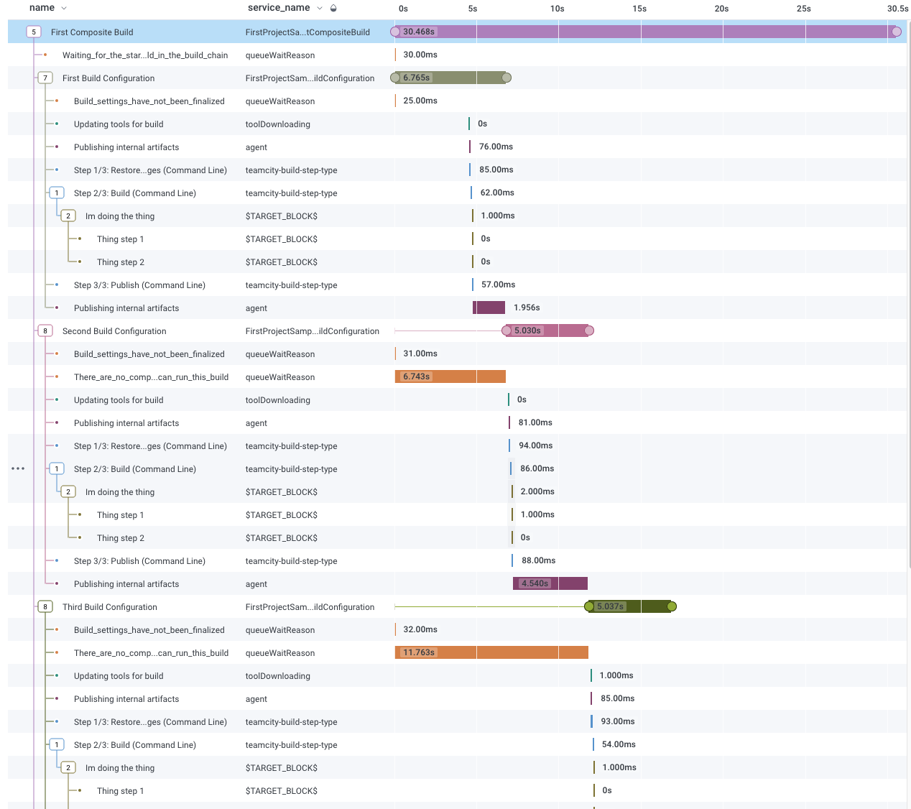

# TeamCity Build OpenTelemetry Exporter Plugin

A TeamCity plugin that sends build trace data to an OpenTelemetry collector endpoint.

This plugin helps you visualize how you can better optimize your TeamCity builds and their dependency trees, by exporting TeamCity build pipeline data automatically to existing OpenTelemetry collector such as [Honeycomb](https://www.honeycomb.io/), [Zipkin](https://zipkin.io/) or [Jaeger](https://www.jaegertracing.io).



## What is OpenTelemetry


From the [OpenTelemetry docs](https://opentelemetry.io/docs/):

> You can use OpenTelemetry to instrument, generate, collect, and export telemetry data (metrics, logs, and traces) for analysis in order to understand your software's performance and behavior. Create and collect telemetry data from your services and software, then forward them to a variety of analysis tools. For more information about OpenTelemetry go to https://opentelemetry.io/.

## How to use this plugin

### Installing the plugin to TeamCity

1. Build the plugin using the "Building" instructions below.
2. In your TeamCity instance go to the configuration settings for the project which you want to start sending data for (the root project is a good candidate for sending everything!), and choose `OpenTelemetry` in the left menu
3. Tick Enable, and enter the required settings
   1. If you are using honeycomb.io, use the following settings:
      1. Service: `Honeycomb.io`
      2. Api Key: The honeycomb.io api key
      2. Team: Your team name from honeycomb (as shown in the browser url)
      3. Dataset: The dataset you want to send data to
   2. If you are using Zipkin.io:
      1. Service: `Zipkin`
      2. Endpoint: The url of your zipkin instance (eg `http://localhost:9411/`)
   3. If you are using another service, use the following settings:
      1. Service: `Custom`
      2. Endpoint: The url of the service
      3. Headers: The service specific headers required
4. Note that settings are inherited and can be overridden by child project settings
5. Install the .zip using your TeamCity instance UI via Administration -> Plugins -> Upload. Restart if required.

### Logging

To view logs from the plugin, add the following sections to the `conf/teamcity-server-log4j.xml` file in your teamcity installation:

Under `Appenders`:
```xml
    <DelegateAppender>
      <RollingFile name="OTEL.LOG" fileName="${sys:teamcity_logs}/teamcity-otel-plugin.log"
                   filePattern="${sys:teamcity_logs}/teamcity-otel-plugin.log.%i"
                   append="true" createOnDemand="true">
        <PatternLayout pattern="[%d] %6p - %30.30c - %m%n" charset="UTF-8"/>
        <SizeBasedTriggeringPolicy size="10 MB"/>
        <DefaultRolloverStrategy max="3" fileIndex="min"/>
      </RollingFile>
    </DelegateAppender>
```

Under `Loggers`:
```xml
    <Logger name="com.octopus.teamcity.opentelemetry" level="DEBUG" additivity="false">
      <AppenderRef ref="OTEL.LOG" />
    </Logger>
```

## Local Development

### Using Docker

For detailed instructions check the [TeamCity docker hub docs](https://hub.docker.com/r/jetbrains/teamcity-server).

1. Ensure you have docker running
2. Run `docker pull jetbrains/teamcity-server`
3. Run 
```bash 
docker run -it --name teamcity-server-instance \
   -v <path-to-data-directory>:/data/teamcity_server/datadir \
   -v <path-to-logs-directory>:/opt/teamcity/logs  \
   -p <port-on-host>:8111 \
   jetbrains/teamcity-server
```
   
5. Run `docker pull jetbrains/teamcity-agent`
6. Run 
```bash 
docker run -it -e SERVER_URL="<url to TeamCity server>"  \
   -v <path to agent config folder>:/data/teamcity_agent/conf  \      
   jetbrains/teamcity-agent
 ```

### Running Locally

You must have a TeamCity instance running. To run a TeamCity instance locally:
1. Download the TeamCity distro for your OS from https://www.jetbrains.com/teamcity/download/#section=on-premises.
2. Unzip the distro and place in a directory of your choosing. 
3. To run the default server, open terminal then cd in your TeamCity directory then run `./bin/teamcity-server.sh run`. An alias these commands for repeated future can be made.
4. In a separate terminal, to run the default agent, cd in your TeamCity directory then run `./buildAgent/bin/agent.sh run`.
5. Open localhost:8111 in a browser.
6. On your first run create an admin login (this setup only needs to take place once due to the configuration mount). Once the server starts up, navigate to Agents->Unauthorized and authorise the agent that was started in a container alongside the server.
7. (Optional) If attaching a remote debugger run in your TeamCity directory `export TEAMCITY_SERVER_OPTS=-agentlib:jdwp=transport=dt_socket,server=y,suspend=n,address=8111 && $SCRIPT_PATH/bin/teamcity-server.sh run` for the server and `export TEAMCITY_SERVER_OPTS=-agentlib:jdwp=transport=dt_socket,server=y,suspend=n,address=8111 && $SCRIPT_PATH/buildAgent/bin/agent.sh run` for the default agent.
8. Configure the settings as per `Installing the plugin to TeamCity` above.
9. To stop the TeamCity server and agent from running, in a separate terminal cd to your TeamCity directory and run `./bin/runAll.sh stop`

### Building

To build the plugin from code:
1. Ensure your `$JAVA_HOME` points to a java11 JDK installation
2. Install TeamCity
3. Inside the root project folder run `./gradlew build`. The gradlew script will download Gradle for you if it is not already installed.
4. The plugin is available at `<project_root>/build/distributions/Octopus.TeamCity.OpenTelemetry.<version>.zip`.
5. Copy to `.zip` to your TeamCity `data_dir/plugins` directory and restart TeamCity server OR install the `.zip` using your TeamCity instance UI.

### Testing

JUnit tests have been added to package test folders.

To test the plugin from code:
1. Ensure your `$JAVA_HOME` points to a java11 JDK installation
2. Inside the root project folder run `./gradlew test`. The gradlew script will download Gradle for you if it is not already installed.

### Cleaning

To clean the project root directory of builds:
1. Inside the root project folder run `./gradlew clean`. The gradlew script will download Gradle for you if it is not already installed.

### Extending to support a new service

Adding a new endpoint
1. add a new enum value to `OTELService`
2. create yourself a new folder under `server/endpoints`
3. create an implementation of `IOTELEndpointHandler`. This:
   - sets which ui page to use on the build overview (via `getBuildOverviewModelAndView`)
   - creates the OTEL Span Processor to use to configure OTEL (via `BuildSpanProcessor`)
   - converts the incoming settings POST to your settings request object (`GetSetProjectConfigurationSettingsRequest`)
   - converts the saved settings to the UI model (`mapParamsToModel`)
4. create an implementation of `SetProjectConfigurationSettingsRequest`
   - `serviceSpecificValidate` does any validation you require of your settings
   - `mapServiceSpecificParams` maps settings to a hashmap to save
5. add a new case in `OTELEndpointFactory.getOTELEndpointHandler` for your enum value
6. add a new jsp file in `resources/buildserverResources/buildOverviewXXXExtension.jsp` to show info on the build overview
7. modify `ProjectConfigurationTab`. `projectConfigurationSettings.js` and `projectConfigurationSettings.jsp` to show the settings you need (this part still needs refactoring to split things out)
